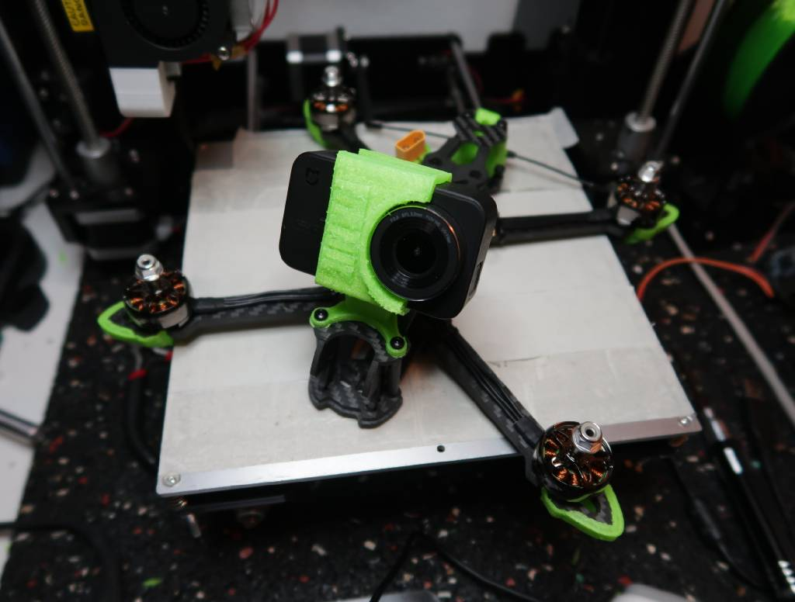
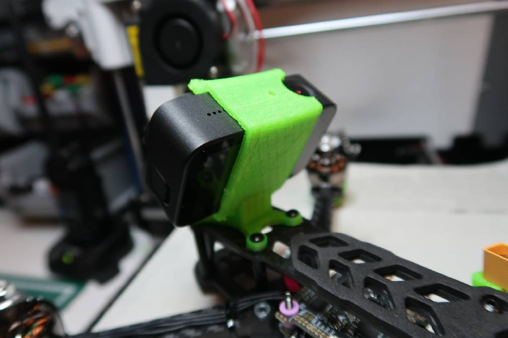

# geprc mark4 xiaomi mijia 4k mount

This is a camera mount for the xiaomi mijia 4k on geprc mark4 frame. This model was made using [solvespace](https://solvespace.com/index.pl),
a free and fun to use CAD application.

This model is also available as a printable STL file on [Thingiverse](https://www.thingiverse.com/thing:4687888)

